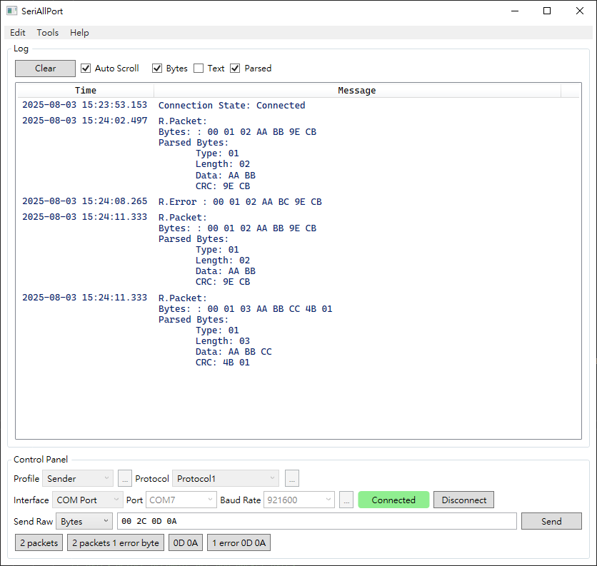
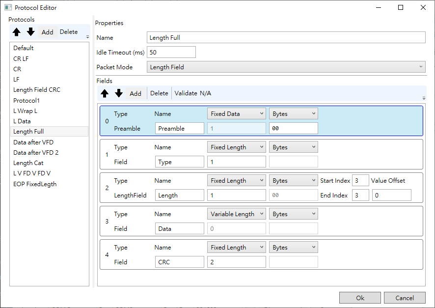

# SeriAllPort

SeriAllPort is a simple UI-based application for inspecting and analyzing data transmissions between a PC and serial devices (e.g., UART, RS-232/422/485).

---

## Platform

- **Operating Systems:** Windows 10, Windows 11  
- **.NET:** .NET 8.0 (LTS)  
- **UI Framework:** WPF



---

# Features _(Work in Progress)_

## Send Raw Data

- Send raw bytes represented in hexadecimal format.  
  _Example:_ `AA BB 11 22`
- Send plain text encoded in UTF-8.  
  _Example:_ `text`

---

## Protocol System

When data is received, it may be displayed across multiple lines if the application does not understand the device’s protocol. For example, a stream like `31 32 0D 0A` might appear as:

```
Received: 31 32 0D
Received: 0A
```

The **Protocol System** allows you to define how SeriAllPort parses the incoming data stream into **packets**, making the data easier to interpret.

### Packet Modes

**1. Timeout**

Use a timeout to separate packets when the connected device does not use any kind of explicit packet boundaries. If there is no incoming data for the specified time, SeriAllPort treats the received bytes as one packet.

_Example:_ Idle Timeout: 50 ms  
```
Data stream: 31 32 0D 0A [idle for 100 ms] 33 34 0D 0A

Received: 31 32 0D 0A // first packet
// idle for 100 ms
Received: 33 34 0D 0A // second packet
```

---

**2. End of Packet Symbol**

Specify a termination character or sequence (e.g., CR, LF, CRLF) to mark the end of a packet. For example, if the **End of Packet Symbol** is `0D 0A`:

```
Data stream: 31 32 0D 0A 33 34 0D 0A

Received: 31 32 0D 0A // first packet
Received: 33 34 0D 0A // second packet
```

---

**3. Length Field** _(Planned)_

Support for fixed-length fields that determine packet size automatically.

---

### Field Types

- **Preamble**  
  Optional. If defined, SeriAllPort scans for the preamble as the start of a packet. Bytes between the end of the last packet and the next valid preamble are marked as errors (`R.Error`).  
  - Must be **Fixed Data** field.
  - Must be the first field.

- **Fields**  
  User-defined fields within the packet.

- **End of Packet**  
  Defines a termination symbol for packets.  
  - Required if **Packet Mode** is **End of Packet Symbol**.
  - Cannot be used with **Timeout** mode.

---

### Field Length Modes

- **Fixed Length**  
  The length is defined and SeriAllPort extracts data accordingly.

- **Fixed Data**  
  Both length and content must match the specified value.  
  _Example_: **Preamble** and **End of Packet** are **Fixed Data** fields.

- **Variable Length**  
  The length is determined dynamically by other fields in the packet.  
  - Consecutive variable-length fields are not supported.

---

## Profile System

SeriAllPort allows you to save your configuration as a **Profile**, making it easy to switch between different device setups.

A profile can include:

- Used Protocol
- COM Port settings
- Preferred data display format
- Default send mode: raw bytes or plain text

---
